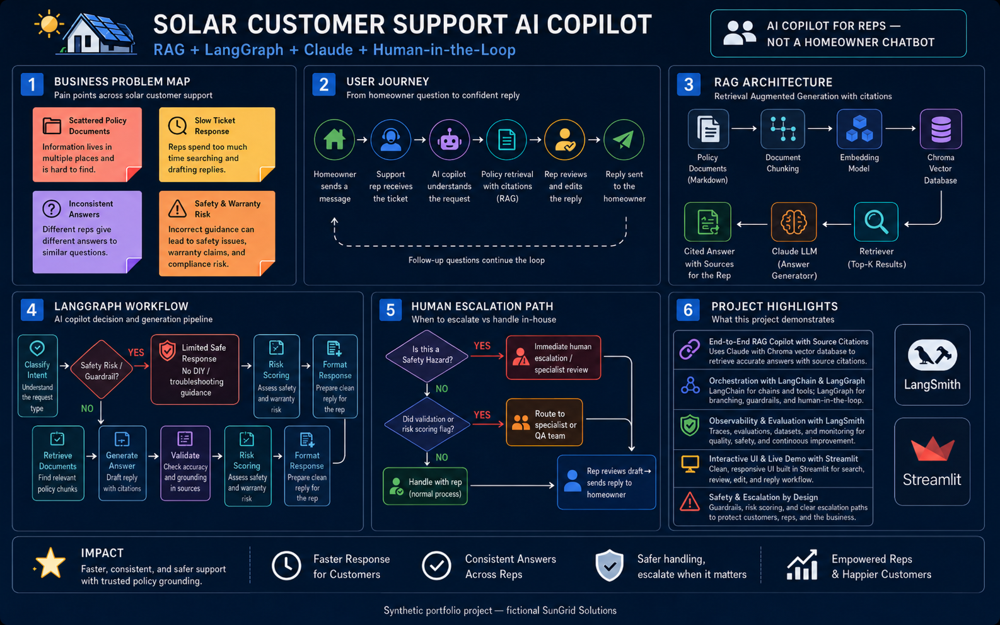
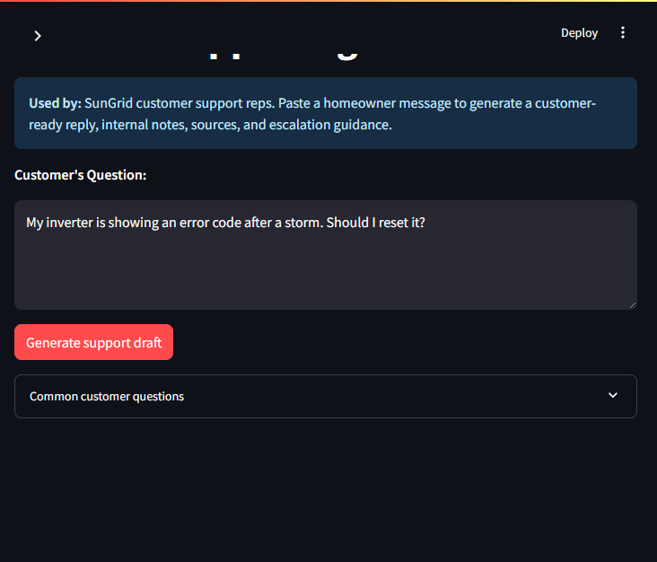

# SunGrid Support Agent

**AI copilot for solar customer support reps** — grounded answers from internal policy documents, with risk scoring, escalation guidance, and full source transparency.

[](https://sungrid-support-agent.streamlit.app)  

> **Live demo:** _Coming soon — Phase 8 deploy_  
> **Synthetic portfolio project** — fictional company documents only. Not real solar, warranty, safety, or financial advice.

---

## 60-second summary

SunGrid Solutions support reps spend too much time searching warranty policies, troubleshooting guides, safety procedures, and financing FAQs. **SunGrid Support Agent** lets a rep paste a homeowner message and get:

- A **customer-ready reply** draft
- An **internal note** with issue type and recommended action
- **Sources** and retrieved policy excerpts
- **Risk level**, **confidence**, and **escalation** guidance
- A **workflow trace** showing each LangGraph step

Built for **Solutions Engineer / Applied AI / FDE** roles — business problem first, RAG + LangGraph + LangSmith as proof.

---

## Business problem

- Reps manually search 5+ internal documents per ticket
- Slow, inconsistent answers create warranty, safety, and financing risk
- Safety questions must escalate immediately — no DIY electrical advice
- Financing answers need careful language with no unauthorized guarantees

## What the rep gets per query

| Output | Purpose |
|---|---|
| Results metrics | Risk, confidence, escalation, source count at a glance |
| Internal note | Issue type + recommended action before reviewing the draft |
| Customer reply | Polished draft the rep can send after review |
| Answer trace | LangGraph path, sources, and retrieved chunks for explainability |

---

## Project overview



*AI copilot for reps — not a homeowner chatbot. Covers business problem, user journey, RAG architecture, LangGraph workflow, human escalation, and recruiter highlights.*

**Normal path:** classify → retrieve → generate → validate → risk scoring → format response

**Safety path:** safety flag detected → limited safe response → high risk + escalation (no troubleshooting)

| Node | Role |
|---|---|
| `classify_intent` | Intent labels + safety flag |
| `retrieve_documents` | MMR retrieval from Chroma |
| `generate_answer` | RAG-grounded customer + internal draft |
| `validate_answer` | Check claims against retrieved chunks |
| `risk_scoring` | Risk level, confidence, escalation bool |
| `format_response` | Structured output for Streamlit |

**RAG pipeline:** markdown policies in `docs/` → chunk + embed → Chroma → retriever → Claude → cited answer with sources

---

## Risk and escalation

Escalation is flagged when:
- Safety hazard detected (burning smell, exposed wiring, etc.)
- Validation fails or confidence &lt; 60%
- Recommended action requires immediate handoff (dispatch, escalate to team)

Conditional steps ("escalate only if damage confirmed") do **not** trigger immediate escalation — the rep can continue on the call.

---

## Demo screenshot



---

## Sample Q&A

### Normal case — warranty + production

**Question:** _My panels are producing about 35% less energy than expected. Is this covered under warranty?_

- **Intent:** warranty + troubleshooting  
- **Risk:** Medium · **Escalation:** No  
- **Behavior:** References troubleshooting checklist before warranty review; does not guarantee approval

### Safety case — burning smell

**Question:** _I smell something burning near the inverter. What should I do?_

- **Intent:** safety  
- **Risk:** High · **Escalation:** Yes  
- **Behavior:** Stay away from equipment; no resets or DIY advice; escalate immediately

---

## Tech stack

| Layer | Tool |
|---|---|
| LLM | Claude (`claude-sonnet-4-6`) |
| Framework | LangChain |
| Orchestration | LangGraph |
| Vector DB | Chroma (local persisted) |
| Embeddings | HuggingFace `all-MiniLM-L6-v2` |
| Observability | LangSmith |
| UI | Streamlit |

---

## How to run locally

```powershell
git clone <your-repo-url>
cd sungrid-support-agent
python -m venv .venv
.\.venv\Scripts\pip install -r requirements.txt
copy .env.example .env
# Fill in ANTHROPIC_API_KEY and LangSmith keys in .env
.\.venv\Scripts\python run_streamlit.py
```

Open http://localhost:8501 — paste a customer question or pick a sample.

### Quality gates

```powershell
.\.venv\Scripts\python scripts\smoke_test_retrieval.py   # 8/8 retrieval
.\.venv\Scripts\python scripts\smoke_test_graph.py       # 8/8 end-to-end
.\.venv\Scripts\python scripts\run_evaluation.py         # 8/8 eval cases
```

---

## Deployment

_Target: Streamlit Community Cloud (Phase 8)_

1. Push repo to GitHub (no `.env` — use `.env.example`)
2. Connect [share.streamlit.io](https://share.streamlit.io) → `app.py`
3. Add secrets: `ANTHROPIC_API_KEY`, `ANTHROPIC_MODEL`, `LANGCHAIN_*`, `ANONYMIZED_TELEMETRY`
4. First cold start may take ~30s while embeddings load — documented here intentionally

---

## Observability (LangSmith)

Traces appear in project **`sungrid-support-agent`**. Screenshot guide: [`assets/langsmith_capture_guide.md`](assets/langsmith_capture_guide.md)

| Screenshot | Case |
|---|---|
| `assets/langsmith_trace_warranty.png` | Case 1 — warranty / production |
| `assets/langsmith_trace_safety.png` | Case 3 — burning smell |

---

## Visual assets

| Asset | Description |
|---|---|
| [`assets/project_overview.png`](assets/project_overview.png) | Primary architecture + workflow infographic |
| [`assets/streamlit_screenshot.png`](assets/streamlit_screenshot.png) | Demo UI |
| [`assets/demo_script.md`](assets/demo_script.md) | Camtasia narration script (Phase 9) |

---

## Limitations

- Synthetic documents only — not production SunGrid policies
- No CRM, auth, or customer database integration
- Rep must review and approve every draft before sending
- Local embeddings — first run downloads the HuggingFace model

## Future improvements

- Human review queue for high-risk drafts
- Automated eval pipeline in CI
- CRM ticket integration
- Feedback loop from rep edits

---

## Project structure

```
app.py                  # Streamlit UI
run_streamlit.py        # Local demo launcher
src/                    # RAG + LangGraph agent
docs/                   # 5 synthetic policy documents
scripts/                # Smoke tests + evaluation
examples/               # Sample questions + eval cases
assets/                 # Diagrams, screenshots, demo script
```

---

## Disclaimer

Synthetic portfolio demo for fictional **SunGrid Solutions**. Documents, company, and scenarios are fabricated for demonstration. Not real solar, warranty, safety, or financial advice.
